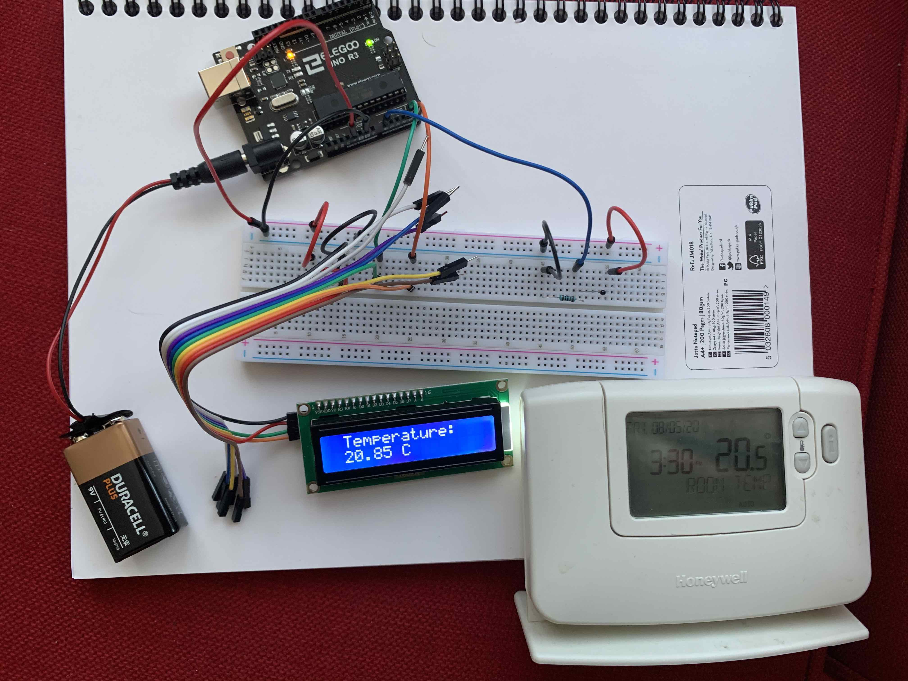
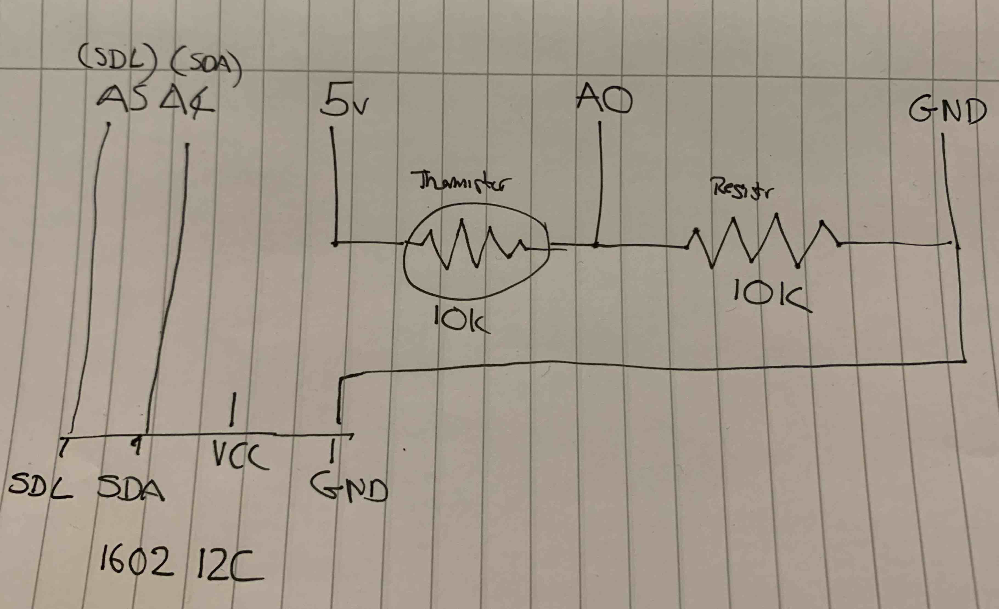

# What?

An Arduino thermometer.

# How?

It reads the temp via a termistor and displays it on a i2c enabled 1602 display

# In action

This is it running. 

The white thing on the bottom left is my heating controller. It's there as a reference as I assume the thermometer inside is vaguely accurate.

# Circuit

