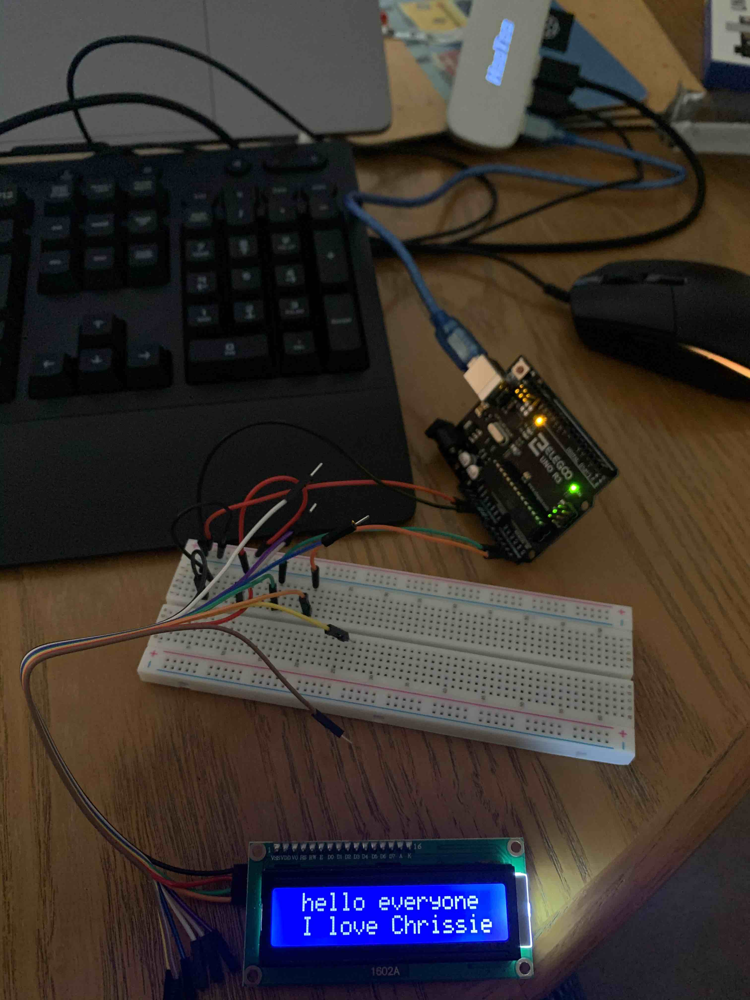

# What?

## Is this

An Arduino "Hello World" on an I2C 1602 Display

## What's a 1602?

A generic 2 line display see http://wiki.sunfounder.cc/index.php?title=I%C2%B2C_LCD1602

These can be bought with with or without I2C modules attached. I got mine as part if this kit: https://www.amazon.co.uk/Freenove-Electronics-Programming-Solderless-Breadboard/dp/B06W54L7B5

## What's i2c?

A serial protocol for embedded devices see https://en.wikipedia.org/wiki/I%C2%B2C

# What does this do?
This

# Docs

## LCD I2C Library

https://www.arduinolibraries.info/libraries/liquid-crystal-i2-c

## Pins

* A4  -> SDA
* A5  -> SCL
* 5V  -> VCC
* GND -> GND

## Refs

https://create.arduino.cc/projecthub/Oniichan_is_ded/lcd-i2c-tutorial-664e5a
https://www.arduino.cc/en/reference/wire
