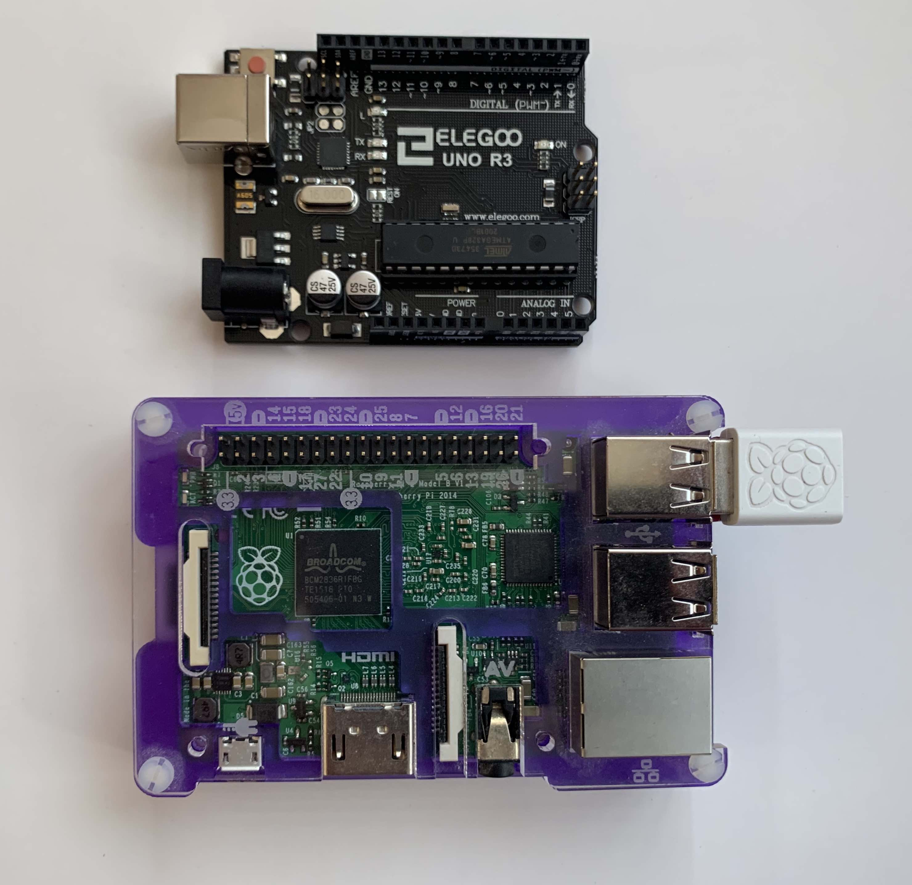

# What is this?

Fun with electronics... featuring a Raspberry Pi and and a (clone) Arduino.

# Stuff I bought

## Arduino

Arduino's are educational development boards. See https://www.arduino.cc/

I bought a clone Uno R3 https://www.amazon.co.uk/dp/B01EWOE0UU

## Electronics Starter kit

There are a few of these about. Look for Freenove and Elegoo. They're all basically the same thing. The PI kit can generally be used with the Arduino and vice-versa, although you may have do do some adapting / adjusting voltages.

The only thing to note Rasperry Pi kits tend to come with a breakout adaptor for the GPIO Pins. They also come with a ADC as the Pi doesn't have analog to digital onboard.

I bought this one: https://www.amazon.co.uk/Freenove-Raspberry-Beginner-Processing-Tutorials/dp/B06WP7169Y

## WiFi

Depends which board you're using.

### Arduino

This can get a bit complicated. Easiest option is to buy a Arduino with Wifi built in. For more fun you can use a module such as an ESP-01: https://www.amazon.co.uk/MakerHawk-ESP8266-ESP-01S-Transceiver-Arduino-As-Shown/dp/B0728CBGKT

### Raspbery PI

This is pretty easy.

Models >3 have WiFi chips built in.

For older PIs (mine is a 2B) you'll need a USB dongle. Try here: https://elinux.org/RPi_USB_Wi-Fi_Adapters

Set-up is via raspi-config or directly editing the config files in /etc.
