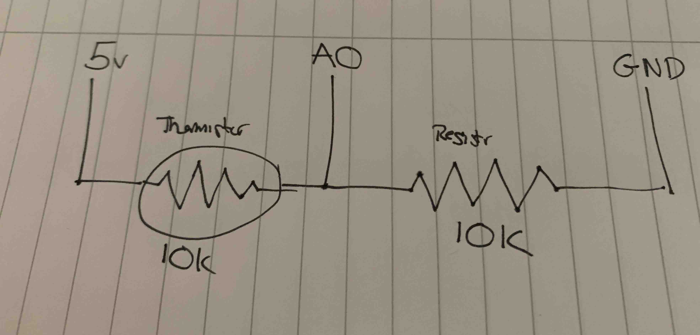
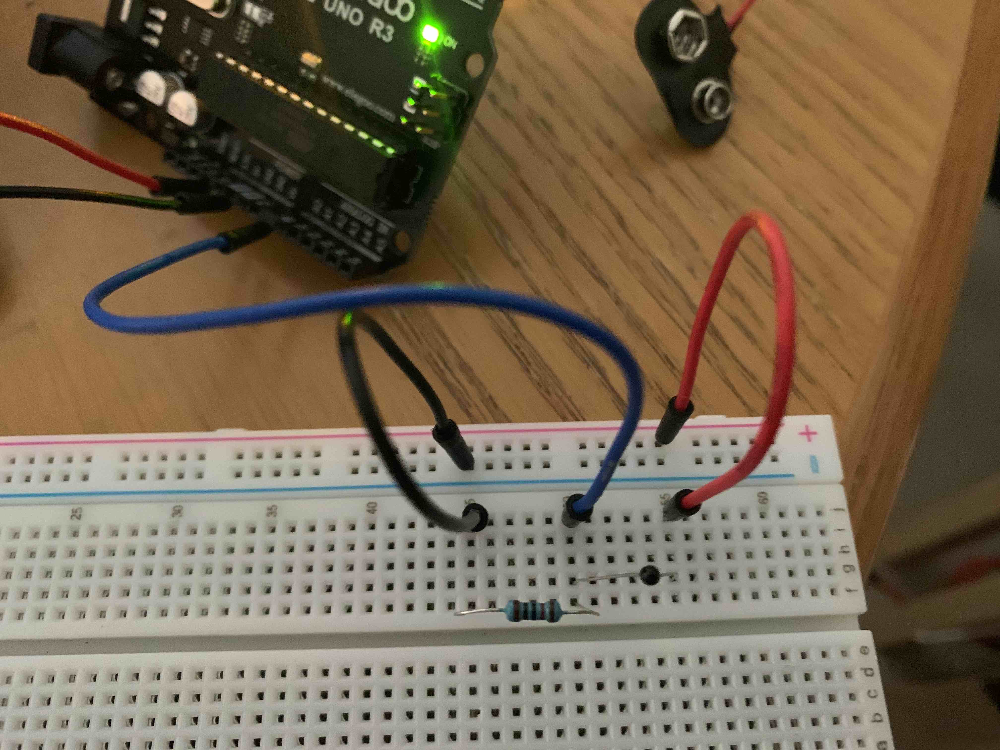
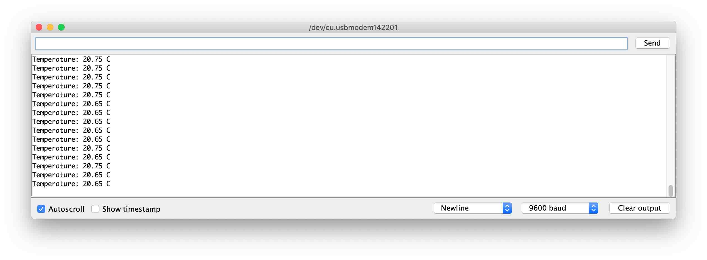

# What

Reading the temperature from a 10k thermistor

# Circuit

## Schematic

## Photo

# Refs

https://www.circuitbasics.com/arduino-thermistor-temperature-sensor-tutorial/

# Output

This will be sent to the Serial TX of the Arduino and can bee seen in the Serial Monitor

