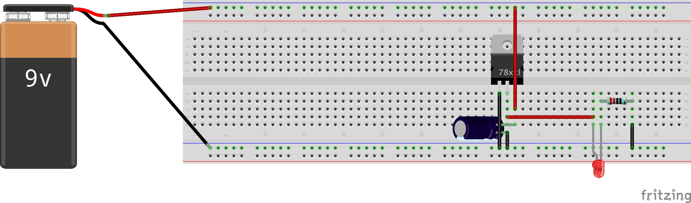

# What

A voltage simple voltage regulator using an LD1117V33 module it converts a higher voltage (in this case 9v) to 3.3 volts and can supply up to 1.5A

Product datasheet is here: https://www.st.com/resource/en/datasheet/cd00002116.pdf

