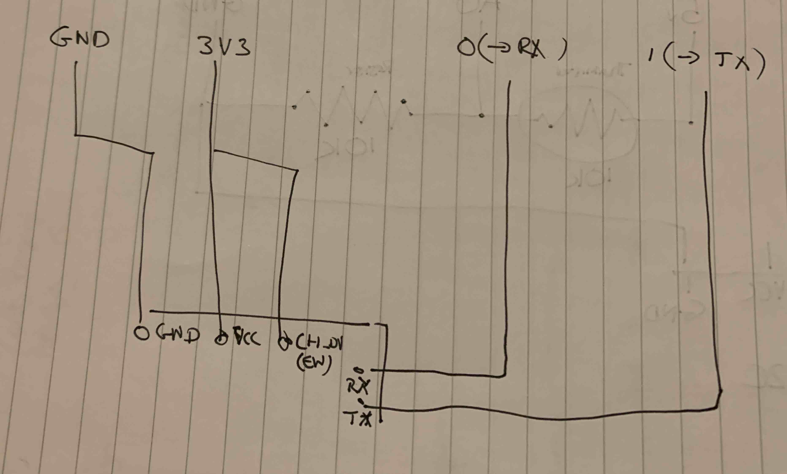
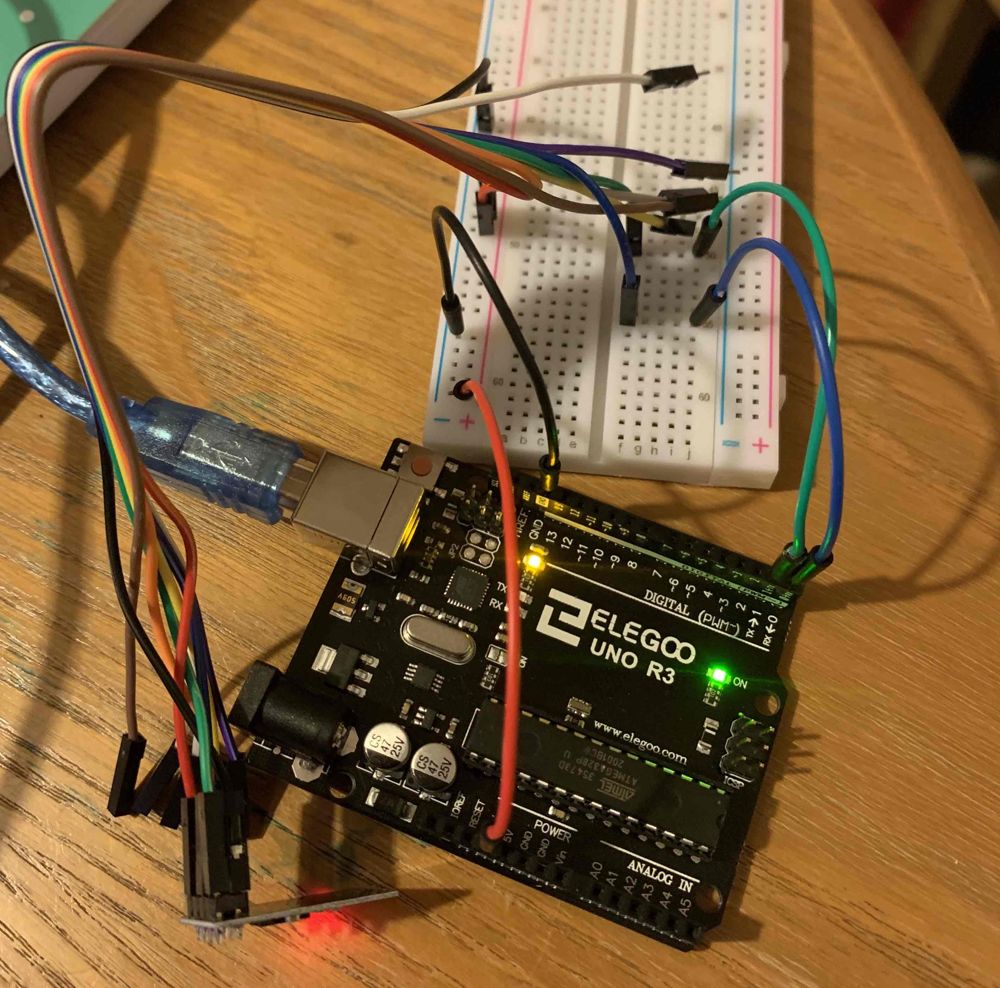

# What

## WiFi?

Yes. Specifically an ESP-01 board with a ESP8266 chipset.

## What are we doing

* Power up the ESP-01 with the Serial passed through to The Arduino
* Send some AT (modem) commands to the Chipset

Essentially we're using the Arduino as a USB->Serial adaptor so that we can send serial commands directly to the serial interface on the ESP8266 chip.

# Set-up

## Wipe the Arduino

Load  the following

```
void setup() {
  // put your setup code here, to run once:

}

void loop() {
  // put your main code here, to run repeatedly:

}
```

## Tutorial

See https://www.instructables.com/id/Getting-Started-With-the-ESP8266-ESP-01/

## Settings

* Speed: 115200 baud (Depends on your board, varies from factory)
* Line endings: Both NL+CR

## Pins

WARNING: You shoudn't really do this. The TX and RX pins on the ESP-01 are 3.3V, Not 5V like the Arduino pins. Whilst this ususally works, you may blow something up!


* 0 -> RX
* 1 -> TX# Reference
* 3V3 -> VCC
* 3V3 -> CH_PD (Marked as EN for 'Enable' on some boards, including mine)
* GND -> GND

## What's the CH_PD pin for?

When you remove the voltage the WiFi chip powers down, the idea being to save power if you running of a battery etc.

## Schematic



## Picture



# Commands

# Reference

* http://www.pridopia.co.uk/pi-doc/ESP8266ATCommandsSet.pdf
* https://github.com/Edragon/Datasheet/blob/master/ESP8266/4b-esp8266_at_command_examples_en.pdf

## Reset

```
AT+RST
```

## Set Mode

* Station = 1
* AP = 2
* Both = 3

```
AT+CWMODE=1
```
To read it back
```
AT+CWMODE?
```

## Read IP

```
AT+CIFSR

+CIFSR:STAIP,"0.0.0.0"
+CIFSR:STAMAC,"a4:cf:12:ef:de:d5"

OK
```

## List Networks

```
AT+CWLAP

+CWLAP:(4,"broadway",-64,"b0:be:76:9e:11:6c",1,-54,0)
+CWLAP:(3,"BTWholeHome-3PM",-47,"0c:8e:29:51:40:51",1,-44,0)
+CWLAP:(3,"BTWholeHome-3PM",-63,"0c:8e:29:51:41:9d",1,-37,0)
+CWLAP:(3,"Guest 4",-64,"0e:8e:29:51:41:9d",1,-37,0)
+CWLAP:(3,"Guest 4",-47,"0e:8e:29:51:42:31",1,-49,0)
+CWLAP:(3,"Guest 4",-48,"0e:8e:29:51:40:51",1,-44,0)
+CWLAP:(3,"BTWholeHome-3PM",-47,"0c:8e:29:51:42:31",1,-51,0)
+CWLAP:(3,"TALKTALKC4EC87",-90,"34:db:9c:c4:ec:84",1,-62,0)
+CWLAP:(4,"VM3231936",-70,"c0:05:c2:3f:36:81",6,-54,0)
+CWLAP:(5,"Virgin Media",-69,"d2:05:c2:3f:36:81",6,-56,0)
+CWLAP:(3,"DIRECT-D1-HP DeskJet 3700 series",-60,"40:b0:34:61:b1:d3",6,-37,0)
+CWLAP:(5,"Virgin Media",-82,"d2:05:c2:5a:32:81",6,-66,0)
+CWLAP:(3,"BTBHub6-765J",-82,"e8:ad:a6:df:d5:b0",6,-47,0)
+CWLAP:(0,"BTWi-fi",-82,"ea:ad:a6:df:d7:b1",6,-46,0)
+CWLAP:(3,"SKY701C5",-92,"70:50:af:1b:02:ca",1,-44,0)
+CWLAP:(3,"broadway",-62,"1c:b7:2c:a6:e3:58",10,-56,0)
+CWLAP:(3,"broadway_guest",-62,"1c:b7:2c:a6:e3:59",10,-57,0)
+CWLAP:(3,"Guest 4",-82,"ee:f4:51:d9:49:78",1,-52,0)

OK
```

## Join a network
```
AT+CWJAP= “Wi-FiNetwork”,“Password” 

WIFI CONNECTED
WIFI GOT IP

OK
AT+CIFSR

+CIFSR:STAIP,"192.168.1.219"
+CIFSR:STAMAC,"a4:cf:12:ef:de:d5"

OK
```
## Request a URL

## Set the connection mode

The Serial interface can support 4x logical connections. If you have logical connections you have to supply
a connection no. to the subsiquent calls.

* 0 = No mux
* 1 = Mux

```
AT+CIPMUX=0

OK
```

### Connect

```
AT+CIPSTART="TCP","www.google.com",80
```

### Send the request string

```
AT+CIPSEND=28 //String is 24 + 4 extra bytes for 2x "\r\n" newlines
GET /index.html HTTP/1.1(return)
(return)
```
At this point we start to get the result from the server
```
+IPD,1430:HTTP/1.1 200 OK
Date: Sun, 10 May 2020 21:48:19 GMT
Expires: -1
Cache-Control: private, max-age=0
Content-Type: text/html; charset=ISO-8859-1
P3P: CP="This is not a P3P policy! See g.co/p3phelp for more info."
Server: gws
X-XSS-Protection: 0
X-Frame-Options: SAMEORIGIN
Set-Cookie: 1P_JAR=2020-05-10-21; expires=Tue, 09-Jun-2020 21:48:19 GMT; path=/; domain=.google.com; Secure
Set-Cookie: NID=204=SwFybZgc-BDHW91qWXBrZM6k9q2PknpKnDkWgRsgg8F7ramQ2isYYfZYP6pCMadXTp3xj7WuVTx19gA_fxWWKbqSoqVUNU-TdbYX5EI2amAidutqDyaWBa-CyyF94Bd0lkPbYxyBLdBXSj3rncT41CwsvFdCaVcf5HG_5SPhphs; expires=Mon, 09-Nov-2020 21:48:19 GMT; path=/; domain=.google.com; HttpOnly
Accept-Ranges: none
Vary: Accept-Encoding
Transfer-Encoding: chunked
```

### Close the connection

```
AT+CIPCLOSE
```
